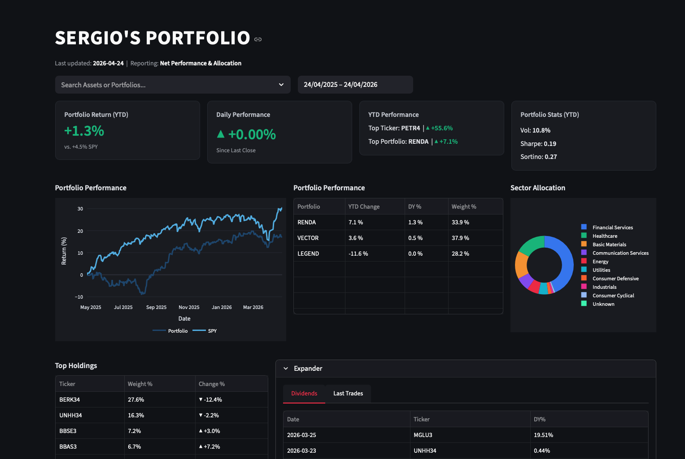

<!-- Hero -->
<h1 align="center">Portfolio Dashboard</h1>

<p align="center">
  <strong>Professional stock portfolio dashboard for interested investors, friends and family that would like to take a peek at my different portfolios.</strong>
</p>

<p align="center">
  <a href="https://github.com/sergiobk201/portfolio_dashboard/actions"></a>
  <a href="LICENSE"></a>
  <a href="https://github.com/sergiobk201/portfolio_dashboard/stargazers"></a>
  
</p>

<p align="center">
  
</p>

---

## ✨ Overview

This project provides an automated, investor-ready dashboard for tracking and reporting portfolio performance. It ingests trade, dividend, and price data from various sources (Gmail notifications, market APIs) into a centralized Supabase database, calculating institutional-grade metrics like Time-Weighted Return (TWR) and risk-adjusted ratios.

Built with a focus on transparency and professional aesthetics, it serves as a central hub for sharing portfolio insights with trusted parties while maintaining data integrity through daily automated refreshes.

## 🚀 Features

- 🔄 **Automated Pipelines** — Daily ingestion of dividends, trades (via Gmail), and market prices using GitHub Actions.
- 📊 **Quant Metrics** — Institutional performance tracking including TWR, Sharpe Ratio, and Sortino Ratio.
- 📉 **Risk-Free Integration** — Real-time risk-free rate alignment using 13-week US T-bill yields (^IRX).
- 🎨 **Interactive UI** — High-fidelity Streamlit dashboard with custom CSS and Plotly financial charts.
- 🔒 **Public Mode** — Integrated support for masking nominal currency figures for external reporting.
- 🏦 **Supabase Backend** — Centralized PostgreSQL storage for historical performance and trade ledgers.

## 📸 Live Portfolio 

> 🔗 **Click here:** (https://barkel-portfolio.streamlit.app) 

## 🏁 Quick Start

### 1. Clone the repository
```bash
git clone https://github.com/sergiobk201/portfolio_dashboard.git
cd portfolio_dashboard
```

### 2. Set up environment
Create a `.env` file with your Supabase and API credentials:
```env
host=your_db_host
port=5432
dbname=postgres
user=your_user
password=your_password
```

### 3. Install & Run
```bash
pip install -r requirements.txt
streamlit run public_app.py
```

## 📦 Installation

### Requirements
- Python 3.9+
- Supabase (PostgreSQL) account
- Gmail API credentials (for automation)

### Pipelines
The project uses several discrete pipelines:
- `prices_pipeline.py`: Updates market prices.
- `dividends_pipeline.py`: Ingests dividend notices.
- `gmail_automation.py`: Extracts trade data from emails.
- `calculate_daily_twr.py`: Engine for performance calculations.
- `spy_pipeline.py`: Extracts last closing price of SPY

## 🛠 Usage

### Running Automation
Pipelines are designed to run via GitHub Actions but can be triggered manually:
```bash
# Update daily prices
python prices_pipeline.py

# Calculate performance metrics
python calculate_daily_twr.py

# Update SPY prices
python spy_pipeline.py
```

### Dashboard Customization
The main dashboard is located in `public_app.py`. It uses a custom CSS injection to achieve a professional dark-themed "Institutional" look.

## 🏗 Architecture

The system is designed for modularity and vectorized performance:
- **Ingestion Layer:** Python scripts running in GitHub Actions.
- **Persistence Layer:** Supabase (PostgreSQL) for all time-series data.
- **Calculation Layer:** NumPy/Pandas-based TWR and risk metric engine.
- **Presentation Layer:** Streamlit v1 for interactive reporting.

## 🗺 Roadmap

- [x] Phase 1: Research & Setup
- [x] Phase 2: Streamlit Prototype
- [x] Phase 3: Reporting & Polish (Sharpe/Sortino)
- [x] Phase 4: Full "Public Mode" implementation

## 📝 Changelog

- **v0.3.0** — Added advanced risk metrics (Sharpe, Sortino) and ^IRX integration.
- **v0.2.0** — Implemented full Supabase integration and daily GitHub Actions.
- **v0.1.0** — Initial Streamlit prototype with basic TWR tracking.

See [CHANGELOG.md](CHANGELOG.md) for the full history.

## 🤝 Contributing

Contributions are welcome. Feel free to open an issue or submit a pull request.

## 📄 License

[MIT](LICENSE) © 2026 Sergio B.K.

## 🙏 Acknowledgments

- Financial data powered by [Brapi](https://brapi.dev) & [yfinance](https://github.com/ranaroussi/yfinance).
- UI built with [Streamlit](https://streamlit.io).
- Calculations inspired by institutional TWR standards and common asset management risk-adjusted metrics.
